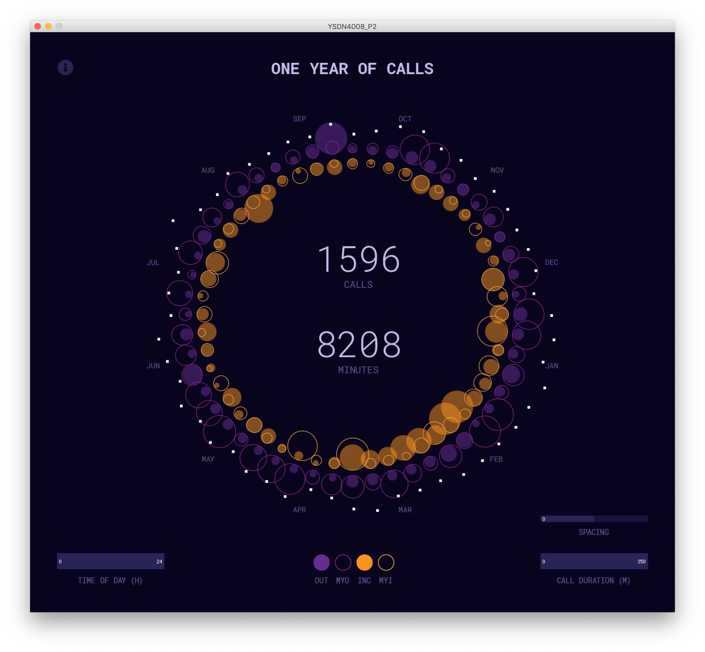

# one-year-of-calls
A Processing sketch that generates a data visualization consisting of one year's worth of cell phone use.

### Dependencies
To run, download the Processing IDE https://processing.org/download/

Requires the controlP5 library 
>Sketch > Import Library > Add Library > Search for controlP5 > Install

